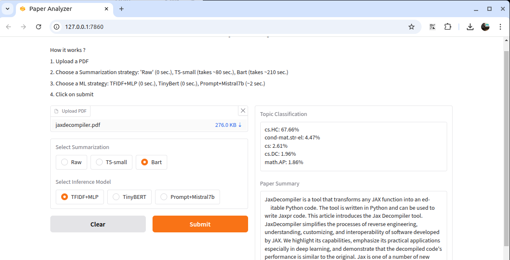

# DeepPaper

My tools for processing large and growing quantity of scientific litterature.

* Abstractify 📝 – Summarizes and classifies PDFs.
* ResearchGrab 🔍 (offline) – Crawls ArXiv & Google Scholar, filtering and downloading papers.
* PaperCluster 📊 (offline) – Clusters & ranks local PDFs using term frequency and visualizations.

## Abstractify

This project consists of two main components: the ML Training notebook (ML_training.ipynb) and the User Interface (ui.py), both designed to facilitate machine learning model training, fine-tuning, and deployment for text classification and summarization tasks.

### Code ideas

This project allows users to build their own workflow according to their tolerance for processing time and desired accuracy. The project offers 3 summarization strategies and the inference of 3 different model types (Machine Learning, Deep Learning, and Large Language Model (LLM) prompting). This results in a total of 9 potential ML workflows (3 summarization strategies multiplied by 3 models). When the topic of an article is ambiguous, combining multiple opinions from different ML workflows may be beneficial compared to relying on a single ML algorithm.

### ML_training.ipynb:

This Jupyter notebook is designed for gaining insights from the training database (https://huggingface.co/datasets/real-jiakai/arxiver-with-category).

The notebook allows experimenting with different models, diverse pre-processing, and hyperparameters tuning. It contains also inference code snippets to copy/paste in 'ui.py' and save trained models in /tmp/. For example: The notebook have been used to test prompt engineering, when the result is good enough, I copied/tested in 'ui.py'.

Files saved by the notebook include :

* /tmp/label_encoder.pkl  : (PyTorch section)
* /tmp/saved_model/  : (PyTorch section)
* /tmp/pytorch_checkpoint/ : (PyTorch section)
* /tmp/model.pkl  : (Scikit-learn section)
* /tmp/class_names.pkl  : (Scikit-learn section)

### ui.py:

The user interface script (ui.py) loads the pre-trained models (saved by ML_training.ipynb) and waits for user input.
Once the user configures the model and uploads PDF files, it performs two main tasks:

* Text Classification: Classifies the content of the PDF file based on the pre-trained machine learning models.
* Text Summarization: Summarizes the content of the PDF using summarization models.

## ResearchGrab (offline)

## PaperCluster (offline)

